# Agentic RAG System - Workflow Diagrams

## 1. Complete System Architecture

This diagram shows the complete data flow through the Agentic RAG system, from user query to final response.

## 2. Agent Interaction Sequence

This sequence diagram shows the step-by-step interaction between agents during query processing.

```mermaid
sequenceDiagram
    participant U as 👤 User
    participant C as 🗄️ Cache
    participant QR as 🧭 Query Router
    participant R as 📚 Retriever
    participant RR as 🎯 Reranker
    participant S as ✍️ Synthesizer
    participant E as 📊 RAGAS
    participant M as 📈 Monitor
    
    Note over U,M: Agentic RAG Pipeline Workflow
    
    U->>C: Submit Query
    
    alt Cache Hit
        C-->>U: Return Cached Response
    else Cache Miss
        C->>QR: Forward Query
        
        Note over QR: Step 1: Query Analysis
        QR->>QR: Classify Intent<br/>(factual/analytical/comparative)
        QR->>QR: Assess Complexity (1-5)
        QR->>QR: Identify Domains
        
        QR->>R: Routing Decision + Query
        
        Note over R: Step 2: Document Retrieval
        R->>R: Apply Chunking Strategy<br/>(Recursive/Semantic/Hybrid)
        R->>R: Search Vector Store
        R->>R: Retrieve Top-K Documents
        
        R->>RR: Initial Documents + Scores
        
        Note over RR: Step 3: Reranking
        RR->>RR: Cross-Encoder Processing
        RR->>RR: Calculate Relevance Scores
        RR->>RR: Sort by Relevance
        RR->>RR: Select Top-5 Documents
        
        RR->>S: Reranked Documents
        
        Note over S: Step 4: Answer Synthesis
        S->>S: Combine Context
        S->>S: Generate Prompt
        S->>S: Call LLM
        S->>S: Format Response
        
        S->>E: Answer + Context
        
        Note over E: Step 5: Evaluation
        E->>E: Calculate Faithfulness
        E->>E: Measure Answer Relevancy
        E->>E: Assess Context Precision
        E->>E: Check Context Recall
        
        E->>M: Evaluation Metrics
        
        Note over M: Step 6: Monitoring
        M->>M: Record Response Time
        M->>M: Track Confidence Score
        M->>M: Update Statistics
        
        M->>C: Final Response
        C->>C: Update Cache
        C->>U: Return Response with Metrics
    end
    
    Note over U: Response includes:<br/>• Answer<br/>• Confidence Score<br/>• Agent Trace<br/>• Evaluation Metrics
```

## 3. Chunking Strategies Workflow

This diagram illustrates the three chunking strategies and how they process documents.

```mermaid
graph LR
    %% Styling
    classDef inputClass fill:#e3f2fd,stroke:#1565c0,stroke-width:2px
    classDef strategyClass fill:#f3e5f5,stroke:#6a1b9a,stroke-width:2px
    classDef processClass fill:#fff8e1,stroke:#f57c00,stroke-width:2px
    classDef outputClass fill:#e8f5e9,stroke:#2e7d32,stroke-width:2px
    
    %% Input Document
    Doc["📄 Input Document<br/>Raw Text"]:::inputClass
    
    %% Chunking Strategy Selection
    Strategy{"🔀 Chunking<br/>Strategy<br/>Selection"}:::strategyClass
    
    %% Recursive Chunking Process
    subgraph Recursive ["📑 Recursive Chunking"]
        R1["Split by Separators<br/>[nn, n, ., !, ?, ;, :, ' ']"]:::processClass
        R2["Check Chunk Size<br/>(500 chars)"]:::processClass
        R3["Add Overlap<br/>(100 chars)"]:::processClass
        R4["Fixed-Size Chunks"]:::outputClass
        
        R1 --> R2
        R2 --> R3
        R3 --> R4
    end
    
    %% Semantic Chunking Process
    subgraph Semantic ["🧠 Semantic Chunking"]
        S1["Generate Embeddings<br/>for Sentences"]:::processClass
        S2["Calculate Similarity<br/>Between Adjacent"]:::processClass
        S3["Find Breakpoints<br/>(80th percentile)"]:::processClass
        S4["Meaning-Based Chunks"]:::outputClass
        
        S1 --> S2
        S2 --> S3
        S3 --> S4
    end
    
    %% Hybrid Chunking Process
    subgraph Hybrid ["🔄 Hybrid Chunking"]
        H1["Apply Both Methods"]:::processClass
        H2["Merge Results"]:::processClass
        H3["Deduplicate"]:::processClass
        H4["Optimal Chunks"]:::outputClass
        
        H1 --> H2
        H2 --> H3
        H3 --> H4
    end
    
    %% Vector Store Processing
    VecProcess["🔤 Embedding Generation<br/>• Transform to vectors<br/>• Normalize embeddings"]:::processClass
    
    VecStore[("🗃️ Vector Store<br/>• FAISS Index<br/>• Metadata Storage<br/>• Similarity Search")]:::outputClass
    
    %% Flow
    Doc --> Strategy
    
    Strategy -->|"recursive"| Recursive
    Strategy -->|"semantic"| Semantic
    Strategy -->|"hybrid"| Hybrid
    
    R4 --> VecProcess
    S4 --> VecProcess
    H4 --> VecProcess
    
    VecProcess --> VecStore
    
    %% Retrieval Process
    Query["🔍 User Query"]:::inputClass
    QueryEmb["Query Embedding"]:::processClass
    SimSearch["Similarity Search<br/>• Cosine Distance<br/>• Top-K Selection"]:::processClass
    Retrieved["📚 Retrieved<br/>Chunks"]:::outputClass
    
    Query --> QueryEmb
    QueryEmb --> SimSearch
    VecStore --> SimSearch
    SimSearch --> Retrieved
    
    %% Notes
    Note1["💡 Recursive: Fast, consistent size<br/>but may break context"]
    Note2["💡 Semantic: Preserves meaning<br/>but variable chunk sizes"]
    Note3["💡 Hybrid: Best of both<br/>but more computation"]
    
    style Note1 fill:#fffde7,stroke:#f57f17,stroke-dasharray: 5 5
    style Note2 fill:#fffde7,stroke:#f57f17,stroke-dasharray: 5 5
    style Note3 fill:#fffde7,stroke:#f57f17,stroke-dasharray: 5 5
    
    Recursive -.-> Note1
    Semantic -.-> Note2
    Hybrid -.-> Note3
```

## 4. High-Level System Overview

This diagram provides a high-level overview of the system components and their relationships.

```mermaid
graph TD
    %% Styling
    classDef primaryClass fill:#1e88e5,color:#fff,stroke:#0d47a1,stroke-width:3px
    classDef agentClass fill:#7b1fa2,color:#fff,stroke:#4a148c,stroke-width:2px
    classDef dataClass fill:#43a047,color:#fff,stroke:#1b5e20,stroke-width:2px
    classDef evalClass fill:#e53935,color:#fff,stroke:#b71c1c,stroke-width:2px
    classDef configClass fill:#fb8c00,color:#fff,stroke:#e65100,stroke-width:2px
    
    %% Title
    Title["🤖 AGENTIC RAG SYSTEM<br/>Multi-Agent Architecture"]:::primaryClass
    
    %% Configuration Layer
    Config["⚙️ Configuration System<br/>• Pydantic Models<br/>• YAML/JSON Support<br/>• Dynamic Settings"]:::configClass
    
    %% Core Agents
    subgraph Agents ["🎭 Specialized Agents (LangChain)"]
        Agent1["Query Router<br/>Intent Analysis"]:::agentClass
        Agent2["Retriever<br/>Document Search"]:::agentClass
        Agent3["Reranker<br/>Relevance Scoring"]:::agentClass
        Agent4["Synthesizer<br/>Answer Generation"]:::agentClass
    end
    
    %% Data Processing
    subgraph DataProc ["📊 Data Processing"]
        Chunking["Advanced Chunking<br/>• Recursive<br/>• Semantic<br/>• Hybrid"]:::dataClass
        Embeddings["Embeddings<br/>HuggingFace"]:::dataClass
        VectorDB["Vector Store<br/>FAISS/Chroma"]:::dataClass
    end
    
    %% Evaluation System
    subgraph Evaluation ["📈 Quality Assurance"]
        RAGAS["RAGAS Metrics<br/>• Faithfulness<br/>• Relevancy<br/>• Precision"]:::evalClass
        Monitor["Performance<br/>Monitoring"]:::evalClass
    end
    
    %% Utilities
    subgraph Utils ["🛠️ Utilities"]
        Cache["Response Cache<br/>TTL-based"]
        DocLoader["Document Loader<br/>Multi-format"]
        QueryProc["Query Preprocessor"]
    end
    
    %% Main connections
    Title --> Config
    Config --> Agents
    Config --> DataProc
    
    Agents --> DataProc
    DataProc --> Evaluation
    
    Agent1 --> Agent2
    Agent2 --> Agent3
    Agent3 --> Agent4
    
    Chunking --> Embeddings
    Embeddings --> VectorDB
    
    Agent4 --> RAGAS
    RAGAS --> Monitor
    
    Utils -.-> Agents
    Utils -.-> DataProc
    
    %% Key Features Box
    Features["✨ KEY FEATURES<br/><br/>✅ 4+ Specialized Agents<br/>✅ 3 Chunking Strategies<br/>✅ Cross-Encoder Reranking<br/>✅ RAGAS Evaluation<br/>✅ Response Caching<br/>✅ Multi-format Support<br/>✅ Async Processing<br/>✅ Configurable Pipeline"]
    
    style Features fill:#e8eaf6,stroke:#3f51b5,stroke-width:2px,stroke-dasharray: 5 5
    
    Monitor --> Features
```

## Understanding the Workflow

### Agent Roles:
1. **Query Router Agent**: Analyzes the user's query to understand intent, complexity, and relevant domains
2. **Retriever Agent**: Searches the vector store using the selected chunking strategy
3. **Reranker Agent**: Uses cross-encoder models to reorder documents by relevance
4. **Synthesizer Agent**: Generates the final answer using the LLM and retrieved contexts

### Chunking Strategies:
- **Recursive**: Traditional fixed-size chunking with character-based splitting
- **Semantic**: Intelligent chunking based on meaning and context boundaries
- **Hybrid**: Combines both approaches for optimal results

### Key Features:
- **Response Caching**: Reduces latency for repeated queries
- **RAGAS Evaluation**: Automatic quality assessment of responses
- **Performance Monitoring**: Tracks metrics like response time and cache hit rate
- **Multi-format Support**: Handles PDF, TXT, MD, CSV, JSON, and HTML documents

### Data Flow:
1. User submits query → Check cache
2. If cache miss → Query router analyzes intent
3. Retriever searches vector store with selected chunking
4. Reranker optimizes document relevance
5. Synthesizer generates answer from context
6. RAGAS evaluates response quality
7. Monitor tracks performance metrics
8. Response returned with confidence and metrics

This architecture ensures high-quality, reliable, and traceable RAG responses with built-in quality assurance.

